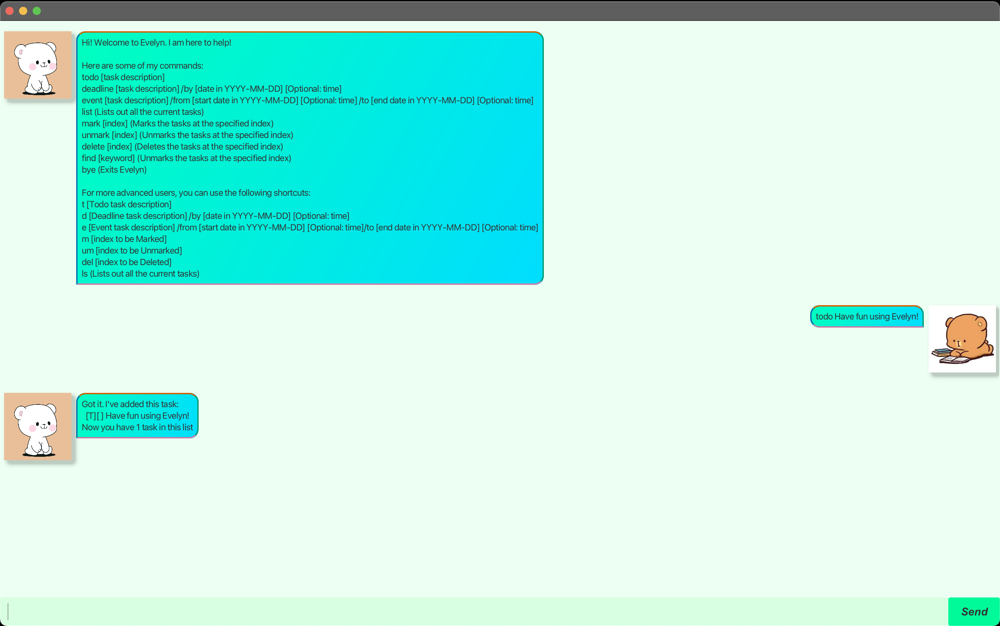

# Evelyn User Guide


Welcome to Evelyn. Evelyn is a text based chat bot that allows you to key in important information to help you remember things better!

Some features of Evelyn include:
- Keeping track of **_Todo_** tasks.
- Keeping track of **_Deadline_** tasks.
- Keeping track of **_Event_** tasks.

Evelyn is a greenfield java project developed for the module CS2103T by the National University of Singapore.

## Configuring Evelyn
Setting up in Intellij
Prerequisites: JDK 17, update Intellij to the most recent version.

1. Open Intellij (if you are not in the welcome screen, click File > Close Project to close the existing project first)
2. Open the project into Intellij as follows:
   1. Click Open.
   2. Select the project directory, and click OK.
   3. If there are any further prompts, accept the defaults.
3. Configure the project to use JDK 17 (not other versions) as explained in here.
4. In the same dialog, set the Project language level field to the SDK default option.
5. After that, using gradle, input the command `.\gradlew run` (if the code editor is showing compile errors, try restarting the IDE).

## Adding Todos
Todos help you keep track of your tasks which do not have an due date.
To do so, input the command into Evelyn:

`todo [your task]` 

Ensure that you swap out "[your task]" with the actual name of the task.

Expected outcome:
```dtd
Got it. I've added this task:
    [T][] [your task]
Now you have (number of tasks) task(s) in this list 
```

## Adding Deadlines
Deadlines help you to keep track of tasks with a due date.
To add a Deadline, input the following command into Evelyn:

`deadline [your task] /by [date in YYYY-MM-DD] [Optional: time]`

Ensure that you swap out "[your task]" with the actual name of the task.

Expected outcome:
```dtd
Got it. I've added this task:
    [D][] [your task] (by: [date] [time, if any]) 
Now you have (number of tasks) task(s) in this list
```

## Adding Events
Events help you keep track of task with a start and end date.
To add an Event, input the following command into Evelyn:

`event [task description] /from [start date in YYYY-MM-DD] [Optional: time] /to [end date in YYYY-MM-DD] [Optional: time]`

Ensure that you swap out "[your task]" with the actual name of the task.

Expected outcome:
```dtd
Got it. I've added this task:
    [E][] [your task] (from: [start date] [time, if any] to: [end date] [time, if any]) 
Now you have (number of tasks) task(s) in this list
```

## Deleting Tasks
Once you no longer have use for a Task, you may delete them.
To delete tasks, input the following command into Evelyn:

`delete [index]`

Ensure that you swap out "[index]" with the index of the task in your list that you want to delete.
```dtd
Noted. I've removed this task:
    [Task description]
Now you have (number of tasks) task(s) in this list
```

## Exiting Evelyn
To exit Evelyn, input the following command into the text box:
`bye`

## Evelyn's Commands
The following is a list of all of evelyn's commands:

- `todo [task description]`
- `deadline [task description] /by [date in YYYY-MM-DD] [Optional: time]`
- `event [task description] /from [start date in YYYY-MM-DD] [Optional: time] /to [end date in YYYY-MM-DD] [Optional: time]`
- `list (Lists out all the current tasks)`
- `mark [index] (Marks the tasks at the specified index)`
- `unmark [index] (Unmarks the tasks at the specified index)`
- `delete [index] (Deletes the tasks at the specified index)`
- `find [keyword] (Finds the tasks at the specified keyword)`
- `bye (Exits Evelyn)`

## Friendlier Syntax
Command syntax is now more flexible for more **advanced users**. Shorter aliases for keywords can be used.
The commands are as follows:

- `t [Todo task description]`
- `d [Deadline task description] /by [date in YYYY-MM-DD] [Optional: time]`
- `e [Event task description] /from [start date in YYYY-MM-DD] [Optional: time] /to [end date in YYYY-MM-DD] [Optional: time]`
- `m [index to be Marked]`
- `um [index to be Unmarked]`
- `del [index to be Deleted]`
- `ls (Lists out all the current tasks)`

## Evelyn Development Timeline
Below is the order in which Evelyn was developed

1. [X] Implement basic UI and logic. Ensure basic tasks are up and running.
2. [X] Switch to a GUI for Evelyn
3. [X] Implement friendlier syntax feature.